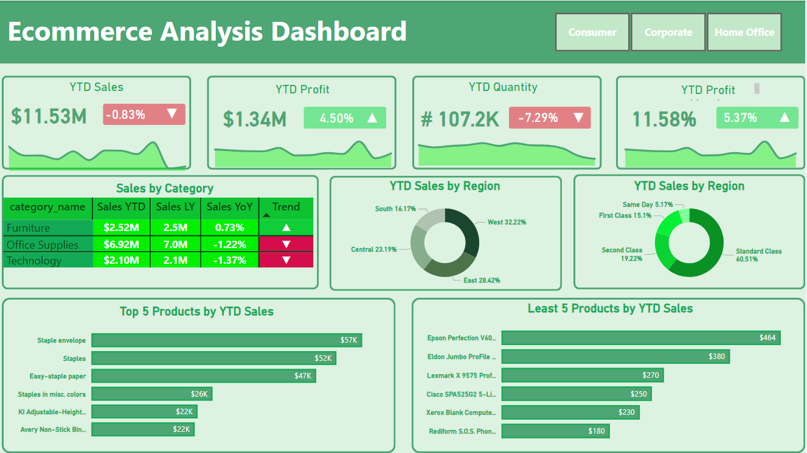

# E-commerce Sales Analysis Dashboard

This project is about creating an **interactive Power BI dashboard** to help an e-commerce business analyze and understand its sales data. The dashboard focuses on key metrics like **sales trends, profit margins, and product performance**. It’s designed to give businesses insights that can help them make smarter decisions to improve sales and grow their business.

### What it does:
- **Tracks Sales & Profit:** Shows how much the business is selling and earning, both overall and for specific time periods.
- **Compares Year-over-Year:** Helps businesses see if sales are growing or shrinking compared to the previous year.
- **Analyzes Product Performance:** Identifies which products are doing well and which ones need attention.
- **Breaks Down Sales by Region & Category:** Shows which areas or customer groups are driving the most sales.
- **Shows Customer Preferences:** Highlights what shipping options customers prefer.

## Dashboard Overview



### Key Features
- **KPIs:** Year-to-Date (YTD) Sales, Profit, Quantity, and Profit Margins.
- **Year-over-Year Analysis:** Year-on-Year (YoY) growth for key metrics.
- **Sales Insights:**
  - Sales by Category and Region.
  - Top 5 and Bottom 5 products by YTD Sales.
- **Dynamic Visuals:** Including sparklines, trend icons, and dynamic formatting.
- **Time Analysis:** Monthly trends for better decision-making.

---

## Functionalities You Will Learn

This project applies advanced Power BI functionalities:

### Data Preparation:
- Connection to flat files.
- Data modeling with relationships between multiple tables.
- Data cleaning using Power Query.

## DAX Calculations
Here are some of the DAX calculations used in this project:

1. **Sales YTD**
   ```DAX
   Sales YTD = TOTALYTD(SUM(ecommerce_data[sales_per_order]), 'Calendar'[Date])
   ```
   Calculates the Year-to-Date (YTD) sales.

3. **Sales LY (Last Year)**
   ```DAX
   Sales LY = CALCULATE(SUM(ecommerce_data[sales_per_order]), SAMEPERIODLASTYEAR('Calendar'[Date]))
   ```
   Calculates sales for the same period last year.

4. **Sales YoY (Year-over-Year)**
   ```DAX
   Sales YoY = ([Sales YTD] - [Sales LY]) / [Sales LY]
   ```
   Calculates Year-over-Year growth for sales.

5. **Sales Icon (for dynamic visuals)**
   ```DAX
    Sales Icon = 
    VAR positive = UNICHAR(9650)  -- Upward arrow
    VAR negative = UNICHAR(9660)  -- Downward arrow
    VAR result = IF([Sales YoY] > 0, positive, negative)
    RETURN result
   ```
   Returns an upward or downward arrow based on YoY sales performance.
6. **Profit YTD**
   ```DAX
   Profit YTD = TOTALYTD(SUM(ecommerce_data[profit_per_order]), 'Calendar'[Date])
   ```
   Calculates the Year-to-Date (YTD) profit.

7. **Profit LY (Last Year)**
   ```DAX
   Profit LY = CALCULATE(SUM(ecommerce_data[profit_per_order]), SAMEPERIODLASTYEAR('Calendar'[Date]))
   ```
   Calculates profit for the same period last year.
---

### Visualizations:
- Conditional formatting and dynamic icons.
- Various Dynamic charts

---

## Problem Statement

A U.S.-based e-commerce sales company required a comprehensive dashboard to:
- Display YTD metrics such as Sales, Profit, Quantity, and Profit Margin.
- Compare YoY performance.
- Visualize trends and growth across customer categories and regions.
- Highlight top-performing and least-performing products.
- Analyze sales by shipping type and customer segment.

---

## Insights and Business Impact

- **Sales Trends:** The West region leads with 32.22% of sales, followed by the East.
- **Product Performance:** "Staple Envelope" is the top product, while "Rediform S.O.S. Phone" is the least-performing.
- **Customer Preferences:** Standard class shipping dominates sales with 60.51%.

---

## Files in Repository

- `Ecommerce_Dashboard.pbix` - Power BI file.
- `ecommerce_data` - Sample datasets used for analysis.
- `README.md` - Project documentation.

---

## Connect with Me

Feel free to reach out if you have questions or want to collaborate!

- **Name:** Bahaa Medhat Wanas  
- **Email:** [bahaawanas427@gmail.com](mailto:bahaawanas427@gmail.com)  
- **LinkedIn:** [Bahaa Wanas](https://www.linkedin.com/in/bahaa-wanas-9797b923a)
